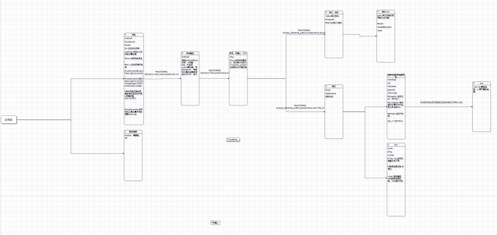
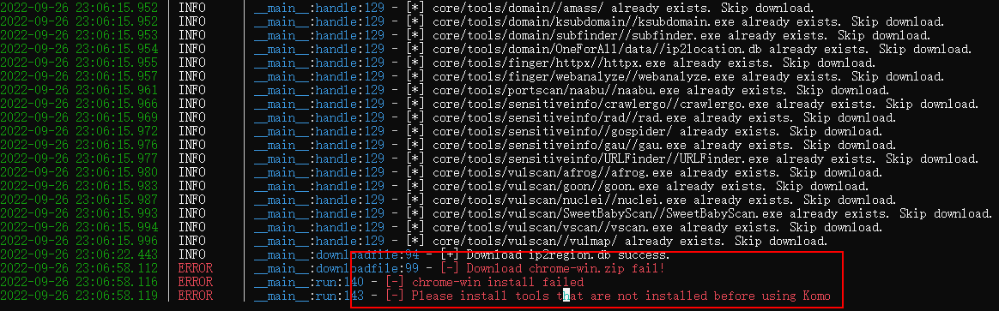
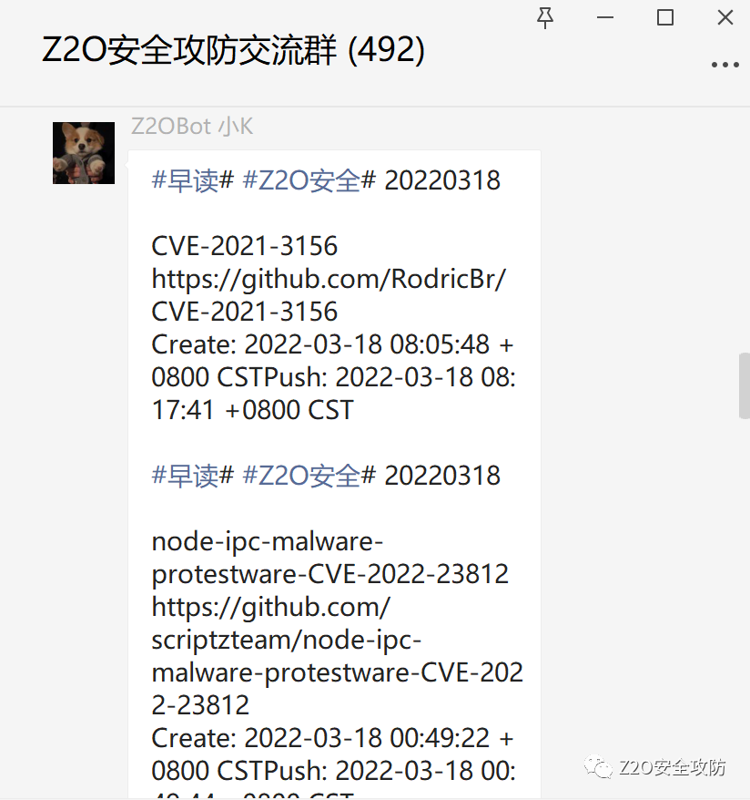
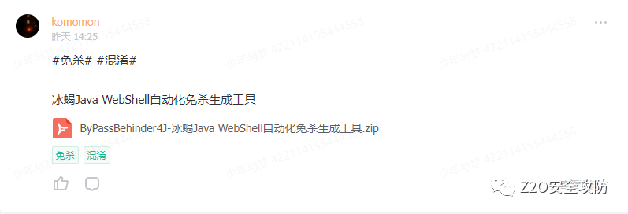
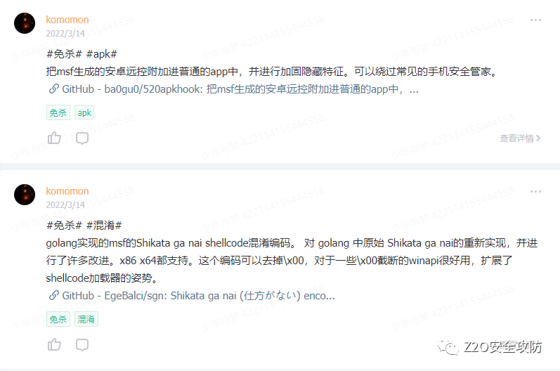
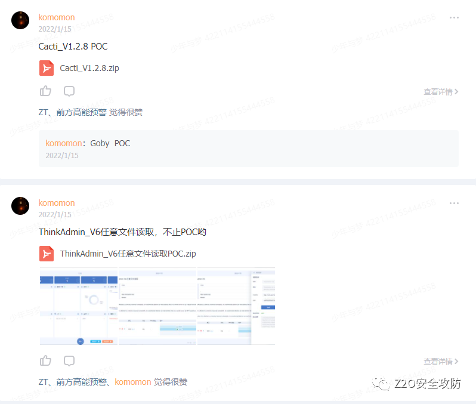

# Komo

```python
Komo is a comprehensive asset collection and vulnerability scanning tool

██╗  ██╗ ██████╗ ███╗   ███╗ ██████╗ {v1.0 #dev}
██║ ██╔╝██╔═══██╗████╗ ████║██╔═══██╗
█████╔╝ ██║   ██║██╔████╔██║██║   ██║
██╔═██╗ ██║   ██║██║╚██╔╝██║██║   ██║
██║  ██╗╚██████╔╝██║ ╚═╝ ██║╚██████╔╝
╚═╝  ╚═╝ ╚═════╝ ╚═╝     ╚═╝ ╚═════╝  By Komomon

```


## Intro&&Feature

🚀**Komo**是一个综合资产收集和漏洞扫描工具，通过多种方式对子域进行获取，收集域名邮箱，进行存活探测，域名指纹识别，域名反查ip，ip端口扫描，web服务链接爬取并发送给xray，对web服务进行漏洞扫描，对主机进行主机漏洞扫描。

🚋**Komo**集成了**oneforall**，**subfinder**，**ksubdomain**，**amass**，**ctfr**，**emailall**，**httpx**，**naabu**，**ehole**，**goon3**，**crawlergo**，**rad**，**gospider**，**URLfinder**，**vscan**，**nuclei**，**afrog**，**vulmap**，**xray**等，全自动化、智能化工具。本工具依托各工具特色，进行模块化构建。

Komo的目的为了一键化，便捷性，可移植性，便于打点和红队外围渗透工作，所以将基于模块化开发，所有工具都汇总到统一接口，以便于下一个模块调用和后续某模块新增工具。**==如果你有好的工具和改进建议，可以添加下面的公众号群聊来沟通==**。

Komo的每个模块可以单独拿出来直接使用，每个模块下面都有一个main，注意工具下载到对应目录下即可。

Komo可以自动下载所需的所有工具，不用使用者自己下载所有工具，使用`python3 Komo.py install` 即可，同时也便于移动，这保证了Komo的体积足够精简。


## Project structure




## Usage

安装`python3`（`python2`暂时不支持）

安装相应的库文件`pip3 install -r requirements.txt`

第一次使用下载所需工具

```python
python3 Komo.py install
```

如下图所示，如果下载失败，则需要手动去下载对应工具到对应目录。



**Komo 支持多种模式**

> collect:只资产收集，多种方式收集域名，收集域名邮箱，域名存活探测，域名反查ip，域名指纹识别，ip端口扫描，web服务链接爬取
>
> all: 资产收集+攻击，多种方式收集域名，收集域名邮箱，域名存活探测，域名反查ip，域名指纹识别，ip端口扫描，web服务链接爬取，将爬取的链接发送给xray进行扫描，反查的ip进行其他端口漏洞扫描
>
> subdomain: 通过多种方式进行域名收集，dns爆破，证书获取，DNS运营商处获取。
>
> finger: 对收集到的域名或域名文件进行存活探测和指纹识别（Ehole+wapplyzer）
>
> portscan：对反查的ip列表或ip文件进行端口扫描
>
> sensitive：对收集到的存活域名或域名文件进行url爬取
>
> webattack：对收集到的存活域名或域名文件进行url爬取，然后发送给xray进行扫描，同时也调用nuclei，afrog，vulmap，vscan进行漏洞扫描
>
> hostattack：对反查的ip列表或ip文件进行常见服务弱口令扫描和漏洞扫描

**all 全扫描**

```python
python3 Komo.py --domain example.com all
python3 Komo.py --domains ./domains.txt all
```

**collect**

```python
python3 Komo.py --domain example.com collect
python3 Komo.py --domains ./domains.txt collect
```

**subdomain**

```python
python3 Komo.py --domain example.com subdomain
python3 Komo.py --domains ./domains.txt subdomain
```

**finger**

```python
python3 Komo.py --url http://example.com finger
python3 Komo.py --urls ./urls.txt finger
```

**sensitive**

```python
python3 Komo.py --url http://example.com sensitive
python3 Komo.py --urls ./urls.txt sensitive
```

**webattack**

```python
python3 Komo.py --url http://example.com webattack
python3 Komo.py --urls ./urls.txt webattack
```

**portscan**

```python

python3 Komo.py --ip example.com portscan
python3 Komo.py --ips ./domains.txt portscan
```

**hostattack**

```python
python3 Komo.py --ip example.com hostattack
python3 Komo.py --ips ./domains.txt hostattack
```

## **完整Usage**

```python
Komo help summary page

Komo is an automated scanning tool set

    mode:
    install     Download the required tools
    all         all scan and attack
        --domain    one domain
        --domains   a domain file
    collect     run all collection modules :subdomain, finger, port, sensitive, poc, to_xray
        --domain    one domain
        --domains   a domain file
    subdomain   only collect subdomain
        --domain    one domain
        --domains   a domains file
    finger      only collect the survival URL and  fingerprint
        --url       one url
        --urls      an urls file
    portscan    only collect port from ip or ips
        --ip        one ip
        --ips       an ips file
    sensitive   only collect directory with crawl,email
        --url       one url
        --urls      an urls file
    webattack   only attack web from url or urls
        --url       one url
        --urls      an urls file
    hostattack  only attack ip from ip or ips
        --ip        one ip
        --ips       an ips file

    Example:
        python3 Komo.py install
        python3 Komo.py --domain example.com all
        python3 Komo.py --domains ./domains.txt all
        python3 Komo.py --domain example.com collect
        python3 Komo.py --domains ./domains.txt collect
        python3 Komo.py --domain example.com subdomain
        python3 Komo.py --domains ./domains.txt subdomain

        python3 Komo.py --url http://example.com finger
        python3 Komo.py --urls ./urls.txt finger
        python3 Komo.py --url http://example.com sensitive
        python3 Komo.py --urls ./urls.txt sensitive
        python3 Komo.py --url http://example.com webattack
        python3 Komo.py --urls ./urls.txt webattack

        python3 Komo.py --ip example.com portscan
        python3 Komo.py --ips ./domains.txt portscan
        python3 Komo.py --ip example.com hostattack
        python3 Komo.py --ips ./domains.txt hostattack

```


## Result

Komo会将输出结果记录到result/{date} 目录下

该目录下会有多个文件夹，分别对应各个模块的输出:

> domain_log
>
> fingerlog
>
> portscan_log
>
> sensitive_log
>
> vulscan_log

result/{date} 根目录下会有输出结果文件：

target 为domain或date

> {target}.final.subdomains.txt 最终找到的所有子域名
>
> {target}.links.csv 多个工具爬取到的所有link
>
> {target}.many.tools.subdomains.txt 除oneforall之外的其他子域名收集工具收集到的域名
>
> {target}.subdomains.ips.txt 域名反查的ip
>
> {target}.subdomains.with.http.txt 存活的子域名并且带http(s)


## 最后

关注**Z2O安全攻防** 公众号回复“**加群**”，添加Z2OBot 小K自动拉你加入**Z2O安全攻防交流群**分享更多好东西。

小K每日在群里发送最新检测到的POC和攻防日报。



**知识星球**

团队建立了知识星球，不定时更新最新漏洞复现，手把手教你，同时不定时更新POC、内外网渗透测试骚操作。感兴趣的可以加一下。








欢迎Star :star: :star:


​    